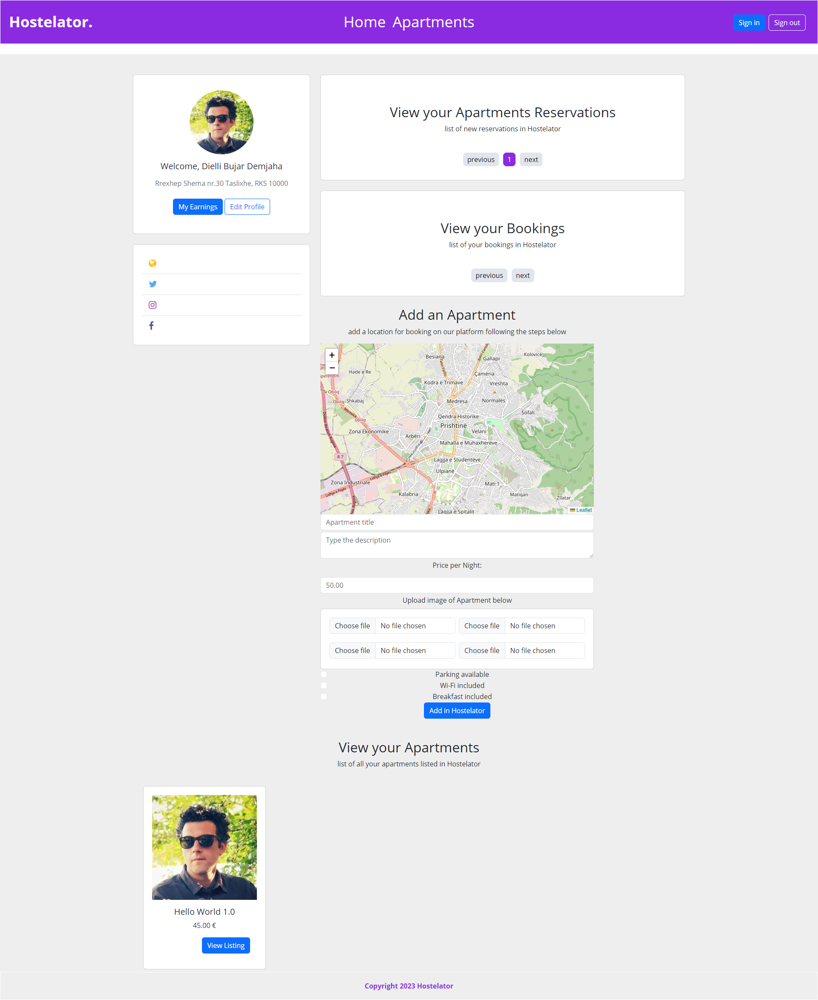

## Hostelator
Hostelator is a web application project designed to simplify hostel management. It provides a user-friendly interface for managing various aspects of hostels, including:



## Authentication
• User Profiles
• Apartment Showcase
• Price Calculation
• Earnings Tracking
• Map Location Integration
• Reservations

## Features
• Authentication: Secure user login and registration.
• User Profiles: Manage user information and preferences.
• Apartment Showcase: Display available apartments with detailed information.
• Price Calculation: Automated price calculation based on various factors.
• Earnings Tracking: Track earnings and financials.
• Map Location Integration: Integrate maps for easy location tracking.
• Reservations: Manage apartment reservations efficiently.

## Installation

>[!NOTE]
> ### Prerequisites
>• PHP >= 7.4
>• Composer
>• Node.js and npm
>• MySQL

## Steps to Install

Clone the repository:

```bash
Copy code
git clone https://github.com/yourusername/hostelator.git
cd hostelator
```
Install Composer dependencies:

```bash
Copy code
composer install
```
Install npm dependencies:

```bash
Copy code
npm install
```

Set up your environment file:

```bash
Copy code
cp .env.example .env
```

Generate application key:

```bash
Copy code
php artisan key:generate
```

Configure your database in the .env file:
```
env
Copy code
DB_CONNECTION=mysql
DB_HOST=127.0.0.1
DB_PORT=3306
DB_DATABASE=your_database_name
DB_USERNAME=your_database_user
DB_PASSWORD=your_database_password
Run the database migrations:
```

```bash
Copy code
php artisan migrate
```

Start the development server:

```bash
Copy code
php artisan serve
```
>[!NOTE]
> The application will be visible at http://localhost:8000.

## Contributing
We welcome contributions! Please submit pull requests to the main branch and ensure all tests are passing.

>[!NOTE]
> ## License
> This project is licensed under the MIT License.
