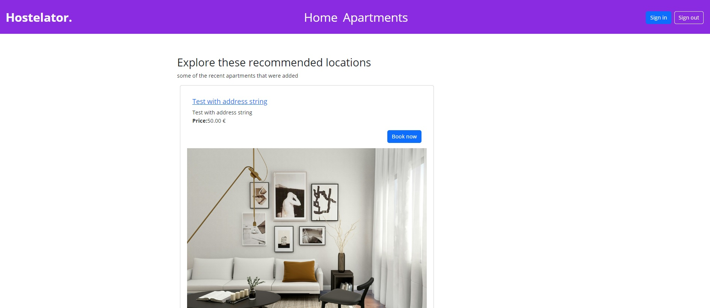
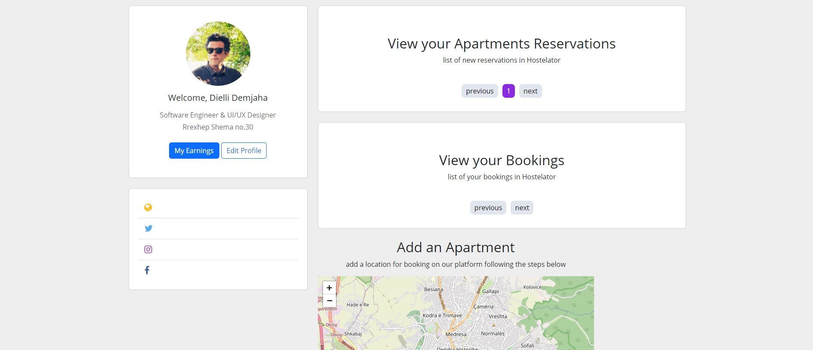

# Hostelator
Hostelator is a full-stack web application that allows users to explore and list apartments. The backend is built with Laravel, providing a robust MVC architecture, while the frontend is developed using ReactJS. The application utilizes a MySQL database to store and manage data.It uses REST API to fetch data from the server.

## Getting Started
Follow these steps to initialize and run the Hostelator application on your local machine.

## Prerequisites
Ensure you have Node.js and Composer installed on your system.
Installation
Clone the repository:

bash
Copy code
```
git clone https://github.com/diellidemjaha/hostelator.git
```
Navigate to the project directory:

bash
Copy code
```
cd hostelator
```

Install Laravel dependencies:

bash
Copy code
```
composer install
```

Install Node.js dependencies:

bash
Copy code
```
npm install
```

Create a copy of the .env.example file and rename it to .env. Update the database configuration with your MySQL credentials.

bash
Copy code
```
cp .env.example .env
```

Generate the application key:

bash
Copy code
```
php artisan key:generate
```

Run the database migrations:

bash
Copy code
```
php artisan migrate
Running the Application
```

Start the Laravel development server:

bash
Copy code
```
php artisan serve
```

The application will be accessible at http://localhost:8000.

Compile the React assets:

bash
Copy code
```
npm run dev
```

Open your browser and visit http://localhost:8000 to view the Hostelator application.

## Usage
Users can freely search for apartments without logging in or signing up.
After registration, users can add their apartments to the listings.
User profiles with profile pictures and records are available.
Apartment details include an image gallery (up to 4 images), price, title, description, and amenities (e.g., parking, Wi-Fi, breakfast included).
The application uses Laravel Sanctum for authentication during login and registration.

## Folder Structure
Laravel backend files are organized in the standard Laravel structure.
ReactJS frontend files can be found in the resources/js/ folder.

## Notes
Make sure your MySQL server is running before attempting to run the application.
OpenStreet Map integration is used for accurate apartment locations.
Now you're all set to explore and utilize Hostelator! If you encounter any issues, refer to the troubleshooting section in the documentation or reach out to our support team. Happy hosting!
